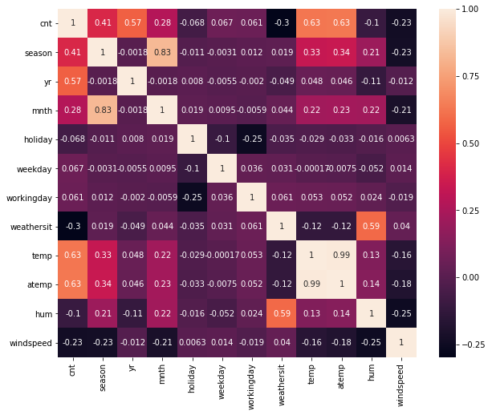
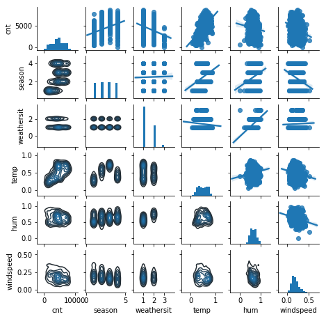
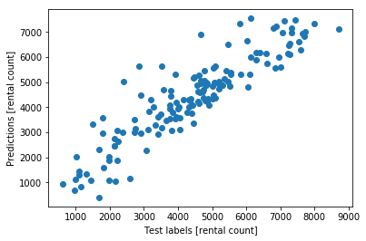

## STAT 6841 Assignment 3

*Michal Lisicki*

## (1.)

Individuals are given a measurable stimulus, to which they may or may not respond. Let $$X$$ be the quantitative measure of the stimulus. Given the stimulus is $$x$$, the probability of an individual responding is $$\pi(x)$$ where

$$
\pi(x) = \frac{e^{\beta_0+\beta_1 x}}{1+e^{\beta_0+\beta_1 x}}
$$

where $$\beta_0​$$ and $$\beta_1​$$ are fixed but unknown parameters. The experiment is conducted for $$K​$$ groups of individuals. For each group, say the $$k​$$th group, $$n_k​$$ individuals were given stimulus $$x_k​$$ and $$r_k​$$ individuals responded out of $$n_k​$$ individuals, for $$k = 1,..., K​$$. Find the MLEs of $$\beta_0​$$ and $$\beta_1​$$. Outline the procedure to get the solutions of MLEs.

**Solution**

An experiment conducted on a subset of individual with success / failure responses can be modelled by a binomial distribution:

$$
f(r_k; n_k, \pi_k) = {n_k \choose r_k} \pi_k^{r_k} (1-\pi_k)^{n_k-r_k}
$$

with probability of the response defined as above:

$$
\pi(x) = \frac{e^{\beta_0+\beta_1 x}}{1+e^{\beta_0+\beta_1 x}}
$$

By substituting for $$\pi(x)$$ this can be also written as:

$$
\begin{align}
f(r_k; n_k, x_k, \beta_0, \beta_1) &= {n_k \choose r_k} \bigg(\frac{e^{\beta_0+\beta_1 x_k}}{1+e^{\beta_0+\beta_1 x_k}}\bigg)^{r_k} \bigg(1-\frac{e^{\beta_0+\beta_1 x_k}}{1+e^{\beta_0+\beta_1 x_k}}\bigg)^{n_k-r_k} \\
&= {n_k \choose r_k} \bigg(\frac{e^{\beta_0+\beta_1 x_k}}{1+e^{\beta_0+\beta_1 x_k}}\bigg)^{r_k} \bigg(\frac{1}{1+e^{\beta_0+\beta_1 x_k}}\bigg)^{n_k-r_k} \\
\end{align}
$$

Then the likelihood of all the experiments can be written simply as:

$$
L(\beta_0,\beta_1; r_k, n_k, x_k) = \prod_{k=1}^K {n_k \choose r_k} \bigg(\frac{e^{\beta_0+\beta_1 x_k}}{1+e^{\beta_0+\beta_1 x_k}}\bigg)^{r_k} \bigg(\frac{1}{1+e^{\beta_0+\beta_1 x_k}}\bigg)^{n_k-r_k}
$$

Then the log-likelihood is:

$$
\begin{align}
l(\beta_0,\beta_1; r_k, n_k, x_k) &= \sum_{k=1}^K \bigg[ \log {n_k \choose r_k} +r_k\log\bigg(\frac{e^{\beta_0+\beta_1 x_k}}{1+e^{\beta_0+\beta_1 x_k}}\bigg) +(n_k-r_k)\log\bigg(\frac{1}{1+e^{\beta_0+\beta_1 x_k}}\bigg) \bigg] \\
&= \sum_{k=1}^K \bigg[ \log {n_k \choose r_k} +r_k(\beta_0+\beta_1 x_k)-r_k\log(1+e^{\beta_0+\beta_1 x_k}) - (n_k-r_k)\log(1+e^{\beta_0+\beta_1 x_k}) \bigg] \\
&= \sum_{k=1}^K \bigg[ \log {n_k \choose r_k} +r_k(\beta_0+\beta_1 x_k)-n_k\log(1+e^{\beta_0+\beta_1 x_k}) \bigg]
\end{align}
$$

To simplify the estimation, in a case of logistic regression, we can define a link function as:

$$
g(\pi_k) = \eta_k = \log \bigg[\frac{\pi_k}{(1-\pi_k)}\bigg] = \sum_{i=0}^p x_{ki}\beta_i
$$

where $$p$$ is the number of parameters minus the intercept, in our case $$p=1$$, and we define $$x_{k0}=1$$ to simplify the notation.

We can then rewrite the log-likelihood as:

$$
l(\beta_0,\beta_1; r_k, n_k, x_k) = \sum_{k=1}^K \bigg[ \log {n_k \choose r_k} +r_k\eta_k-n_k\log(1+e^{\eta_k}) \bigg]
$$

And the utilize the chain rule to compute the derivatives:

$$
\begin{align}
\frac{\partial l}{\partial \beta_i} &= \sum_{k=1}^K \frac{d l}{d \eta_k}\frac{\eta_k}{\beta_i} \\
\frac{dl_k}{d\eta_k} &= r_k - n_k \frac{e^{\eta_k}}{1-e^{\eta_k}} = r_k - n_k \pi_k \\
\frac{\partial \eta_k}{\partial\beta_i} &= x_{ki}
\end{align}
$$

which utilizes the simplifying substitution we can make for $$\pi_k​$$. Then putting it back together we have the score function specified as:

$$
\begin{align}
S(\beta_i) &= \frac{\partial l}{\partial \beta_i} \\
&= \sum_{k=1}^K (r_k - n_k \pi_k)x_{ki} \\
 &= \mathbf{x}_i^T (\mathbf{r} - \boldsymbol{\mu}) 
\end{align}
$$

where $$\mu_k = n_k\pi_k​$$. We can also write it in a full matrix form as:

$$
S(\boldsymbol\beta) = \mathbf{X}^T (\mathbf{r} - \boldsymbol\mu)
$$

Or using the result above, $$S(\eta_k) = \frac{dl_k}{d\eta_k} =  r_k - n_k \pi_k = r_k-\mu_k$$, we can also write it as:

$$
S(\boldsymbol\beta) = \mathbf{X}^T S(\boldsymbol\eta)
$$

If we were to set the derivatives to zero we would notice that the emerging system of equations doesn't have a closed form solution, and therefore we have to resort to iterative methods, like Newton-Raphson:

$$
0 = S(\hat{\boldsymbol\beta}) = S(\boldsymbol\beta^{(0)}) + H(\boldsymbol\beta^{(0)})(\hat{\boldsymbol\beta}-\boldsymbol\beta^{(0)})
$$

where $S(\boldsymbol\beta) = (\frac{\partial l}{\partial \beta_1},...,\frac{\partial l}{\partial \beta_p})^T​$ and $H(\boldsymbol\beta) ={\begin{bmatrix}
\frac{\partial^2 l}{\partial \beta_1^2} & ... & \frac{\partial^2 l}{\partial \beta_1 \beta_p}\\
... & ... & ... \\
\frac{\partial^2 l}{\partial \beta_p \beta_1} & ...& \frac{\partial^2 l}{\partial \beta_p^2}\\
\end{bmatrix}} ​$

with the following update rule:

$$
\boldsymbol\beta^{(j+1)} = \boldsymbol\beta^{(j)} - H^{-1} (\boldsymbol\beta^{(j)}) S(\boldsymbol\beta^{(j)})
$$

where in a case of log-likelihood the Hessian can be interpreted as a negative observed information matrix. So that the rule becomes:

$$
\boldsymbol\beta^{(j+1)} = \boldsymbol\beta^{(j)} + J^{-1} (\boldsymbol\beta^{(j)}) S(\boldsymbol\beta^{(j)})
$$

And the elements of that matrix are derived as follows:

$$
\begin{align}
-\frac{\partial l^2}{\partial\beta_i\beta_j} 
&= -\sum_{k=1}^K \frac{\partial}{\partial \beta_j} \bigg(\frac{\partial l_k}{\partial\beta_k}\bigg) \\
&= -\sum_{k=1}^K \frac{\partial}{\partial \beta_j} \bigg(x_{ki}\frac{d l_k}{d\eta_k}\bigg) \\
&= -\sum_{k=1}^K x_{ki} \frac{\partial}{\partial \beta_j} \frac{d l_k}{d\eta_k} \\
&= -\sum_{k=1}^K x_{ki} \frac{d}{d\eta_k}\frac{\partial \eta_k}{\partial \beta_j} \frac{d l_k}{d\eta_k} \\
&= -\sum_{k=1}^K x_{ki} \frac{d}{d\eta_k} \frac{d l_k}{d\eta_k} x_{kj} \\
&= -\sum_{k=1}^K x_{ki} \frac{d^2 l_k}{d\eta_k^2} x_{kj} \\
&= \sum_{k=1}^K x_{ki} \bigg(-\frac{d^2 l_k}{d\eta_k^2}\bigg) x_{kj} \\
&= \sum_{k=1}^K x_{ki} J(\eta_k) x_{kj} \\
\end{align}
$$

Which in algebraic form can be written as:

$$
J(\boldsymbol\beta) = \mathbf{X}^T J(\boldsymbol\eta) \mathbf{X}
$$

Now we have all the necessary components to break down the update rule:

$$
\begin{align}
\boldsymbol\beta^{(j+1)} &= \boldsymbol\beta^{(j)} + J^{-1} (\boldsymbol\beta^{(j)}) S(\boldsymbol\beta^{(j)}) \\
\boldsymbol\beta^{(j+1)} &= \boldsymbol\beta^{(j)} + (\mathbf{X}^T J(\boldsymbol\eta^{(j)}) \mathbf{X})^{-1} \mathbf{X}^T S(\boldsymbol\eta^{(j)}) \\
(\mathbf{X}^T J(\boldsymbol\eta^{(j)}) \mathbf{X}) \boldsymbol\beta^{(j+1)} &= (\mathbf{X}^T J(\boldsymbol\eta^{(j)}) \mathbf{X}) \boldsymbol\beta^{(j)} + \mathbf{X}^T S(\boldsymbol\eta^{(j)}) \\
(\mathbf{X}^T J(\boldsymbol\eta^{(j)}) \mathbf{X}) \boldsymbol\beta^{(j+1)} &= \mathbf{X}^T J(\boldsymbol\eta^{(j)}) [\mathbf{X} \boldsymbol\beta^{(j)} + J^{-1}(\boldsymbol\eta^{(j)})S(\boldsymbol\eta^{(j)})] \\
(\mathbf{X}^T J(\boldsymbol\eta^{(j)}) \mathbf{X}) \boldsymbol\beta^{(j+1)} &= \mathbf{X}^T J(\boldsymbol\eta^{(j)}) [\boldsymbol\eta^{(j)} + J^{-1}(\boldsymbol\eta^{(j)})S(\boldsymbol\eta^{(j)})] \\
\end{align}
$$

If we substitute:

$$
\mathbf{Z}^{(j)} = \hat{\boldsymbol\eta}^{(j)} + J^{(-1)}(\hat{\boldsymbol\eta}^{(j)})S(\hat{\boldsymbol\eta}^{(j)})
$$

and

$$
\mathbf{W}^{(j)} = J(\hat{\boldsymbol\eta}^{(j)})
$$

This gives the update rule of the Iterative Reweighted Least Squares method:

$$
\boldsymbol\beta^{(j+1)} = (\mathbf{X}^T\mathbf{W}^{(j)}\mathbf{X})^{-1}\mathbf{X}^T\mathbf{W}^{(j)}\mathbf{Z}^{(j)}
$$

with weights $$\mathbf{W}$$ and working response $$\mathbf{Z}$$. Solving this algorithm iteratively gives us the MLE.


## (2.)

Suppose that $$Y$$ is a random variable represent the number of eggs laid by a particular parasite and $$Y$$ follows a Poisson($$\mu$$) distribution. For each egg, it has a probability of $$p$$ of hatching. Let $$X$$ be the number of eggs hatched. Find a joint distribution of $$(X, Y)$$. Given a random sample of size $$n$$: $$(X_1, Y_1), (X_2, Y_2), ... , (X_n, Y_n)$$, find the MLEs of $$(\mu, p)$$.

**Solution**

$$X \sim \text{Binomial}(n,p)$$

$$Y\sim \text{Poisson}(\mu)$$

$$
\begin{align}
f(x,y;p,\mu) &= f(x|y)f(y) \\
&= {y\choose x} p^x(1-p)^{y-x} \frac{e^{-\mu}\mu^y}{y!}
\end{align}
$$

From which follows the likelihood:

$$
L(p,\mu;x,y) = \prod_{i=1}^n {y_i\choose x_i} p^{x_i}(1-p)^{y_i-x_i} \frac{e^{-\mu}\mu^{y_i}}{y_i!}
$$

And the log-likelihood:

$$
l(p,\mu;x,y) = \sum_{i=1}^n \bigg[ \log {y_i\choose x_i} + x_i\log p+ (y_i-x_i) \log (1-p) -\mu +y_i\log\mu - \log y_i! \bigg]
$$

To find MLE we set the derivatives to zero:

$$
\begin{align}
&\begin{cases}
\frac{\partial l}{\partial p} &= \sum_{i=1}^n [ \frac{x_i}{p} -\frac{y_i-x_i}{1-p} ] \\
\frac{\partial l}{\partial \mu} &= \sum_{i=1}^n [-1 + \frac{y_i}{\mu}]
\end{cases} \\\\

&\begin{cases}
0 &= \sum_{i=1}^n [ \frac{x_i}{p} -\frac{y_i-x_i}{1-p} ] \\
0 &= \sum_{i=1}^n [-1 + \frac{y_i}{\mu}]
\end{cases} \\\\

&\begin{cases}
\sum_{i=1}^n \frac{y_i-x_i}{1-p} &= \sum_{i=1}^n \frac{x_i}{p} \\
n &= \sum_{i=1}^n \frac{y_i}{\mu}
\end{cases} \\\\

&\begin{cases}
p \sum_{i=1}^n [y_i-x_i] &= (1-p) \sum_{i=1}^n x_i \\
\mu &= \overline{Y}
\end{cases} \\\\

&\begin{cases}
p \sum_{i=1}^n y_i &= \sum_{i=1}^n x_i \\
\mu &= \overline{Y}
\end{cases} \\\\

&\begin{cases}
\hat{p} &= \frac{\sum_{i=1}^n x_i}{\sum_{i=1}^n y_i} \\
\hat{\mu} &= \overline{Y}
\end{cases} \\\\

\end{align}
$$

## (3.)

Suppose you are given the following three datasets from the following links:
http://archive.ics.uci.edu/ml/datasets/Abalone
http://archive.ics.uci.edu/ml/datasets/Adult
http://archive.ics.uci.edu/ml/datasets/Bike+Sharing+Dataset
Click the Data Folder from the Download on the up-left corner to obtain the data.

Pick one of the datasets you are interested, dene the response variable (choose among all variables) and covariates. Split the data set randomly into two sets: 80% for training set, 20% for testing set. Use least absolute shrinkage and selection operator (LASSO) method (Tibshirani, 1996), or the Elastic Net Regularized Generalized Linear Model (GLMNET) to t the training set. Report the optimal tuning parameter value, the number of covariates retained in the fitted model, the estimate of their effects to the response and the associated standard errors. Use the fitted model to predict the response value of each observation in the testing set. Report the prediction error which is defined as $$PE = E[(Y-\hat{Y})^2]$$ for quantitative response or the accuracy rate for the categorical response.

The LASSO method was implemented in two R packages: "lars" and "glmnet". The Elastic Net Regularized GLM (GLMNET) was implemented in R package "glmnet".
https://cran.r-project.org/web/packages/lars/lars.pdf
https://cran.r-project.org/web/packages/glmnet/index.html


**Solution**


Import the libraries

```python
import time
import numpy as np
np.random.seed(1234)
import pandas as pd 
import warnings
warnings.filterwarnings('ignore')

import matplotlib.pyplot as plt
import seaborn as sns
```

### Dataset

##### Bike Sharing Dataset

**Description of Headers**

- instant: record index
- dteday : date
- season : season (1:springer, 2:summer, 3:fall, 4:winter)
- yr : year (0: 2011, 1:2012)
- mnth : month ( 1 to 12)
- hr : hour (0 to 23)
- holiday : weather day is holiday or not (extracted from http://dchr.dc.gov/page/holiday-schedule)
- weekday : day of the week
- workingday : if day is neither weekend nor holiday is 1, otherwise is 0.

- weathersit :
      - 1: Clear, Few clouds, Partly cloudy, Partly cloudy
      - 2: Mist + Cloudy, Mist + Broken clouds, Mist + Few clouds, Mist
      - 3: Light Snow, Light Rain + Thunderstorm + Scattered clouds, Light Rain + Scattered clouds
      - 4: Heavy Rain + Ice Pallets + Thunderstorm + Mist, Snow + Fog

- temp : Normalized temperature in Celsius. The values are divided to 41 (max)
- atemp: Normalized feeling temperature in Celsius. The values are divided to 50 (max)
- hum: Normalized humidity. The values are divided to 100 (max)
- windspeed: Normalized wind speed. The values are divided to 67 (max)
- casual: count of casual users
- registered: count of registered users
- cnt: count of total rental bikes including both casual and registered 

**Data**

Hour - bike sharing counts aggregated on hourly basis. Records: 17379 hours

```python
hour = pd.read_csv('./hour.csv')
print('Hour data shape: ', hour.shape)
hour.head(5)
```


```
Hour data shape:  (17379, 17)
```

<table border="1" class="dataframe">
  <thead>
    <tr style="text-align: right;">
      <th></th>
      <th>instant</th>
      <th>dteday</th>
      <th>season</th>
      <th>yr</th>
      <th>mnth</th>
      <th>hr</th>
      <th>holiday</th>
      <th>weekday</th>
      <th>workingday</th>
      <th>weathersit</th>
      <th>temp</th>
      <th>atemp</th>
      <th>hum</th>
      <th>windspeed</th>
      <th>casual</th>
      <th>registered</th>
      <th>cnt</th>
    </tr>
  </thead>
  <tbody>
    <tr>
      <th>0</th>
      <td>1</td>
      <td>2011-01-01</td>
      <td>1</td>
      <td>0</td>
      <td>1</td>
      <td>0</td>
      <td>0</td>
      <td>6</td>
      <td>0</td>
      <td>1</td>
      <td>0.24</td>
      <td>0.2879</td>
      <td>0.81</td>
      <td>0.0</td>
      <td>3</td>
      <td>13</td>
      <td>16</td>
    </tr>
    <tr>
      <th>1</th>
      <td>2</td>
      <td>2011-01-01</td>
      <td>1</td>
      <td>0</td>
      <td>1</td>
      <td>1</td>
      <td>0</td>
      <td>6</td>
      <td>0</td>
      <td>1</td>
      <td>0.22</td>
      <td>0.2727</td>
      <td>0.80</td>
      <td>0.0</td>
      <td>8</td>
      <td>32</td>
      <td>40</td>
    </tr>
    <tr>
      <th>2</th>
      <td>3</td>
      <td>2011-01-01</td>
      <td>1</td>
      <td>0</td>
      <td>1</td>
      <td>2</td>
      <td>0</td>
      <td>6</td>
      <td>0</td>
      <td>1</td>
      <td>0.22</td>
      <td>0.2727</td>
      <td>0.80</td>
      <td>0.0</td>
      <td>5</td>
      <td>27</td>
      <td>32</td>
    </tr>
    <tr>
      <th>3</th>
      <td>4</td>
      <td>2011-01-01</td>
      <td>1</td>
      <td>0</td>
      <td>1</td>
      <td>3</td>
      <td>0</td>
      <td>6</td>
      <td>0</td>
      <td>1</td>
      <td>0.24</td>
      <td>0.2879</td>
      <td>0.75</td>
      <td>0.0</td>
      <td>3</td>
      <td>10</td>
      <td>13</td>
    </tr>
    <tr>
      <th>4</th>
      <td>5</td>
      <td>2011-01-01</td>
      <td>1</td>
      <td>0</td>
      <td>1</td>
      <td>4</td>
      <td>0</td>
      <td>6</td>
      <td>0</td>
      <td>1</td>
      <td>0.24</td>
      <td>0.2879</td>
      <td>0.75</td>
      <td>0.0</td>
      <td>0</td>
      <td>1</td>
      <td>1</td>
    </tr>
  </tbody>
</table>


Day - bike sharing counts aggregated on daily basis. Records: 731 days

```python
day = pd.read_csv('./day.csv')
print('Day data shape: ', day.shape)
day.head(5)
```

```
Day data shape:  (731, 16)
```

<table border="1" class="dataframe">
  <thead>
    <tr style="text-align: right;">
      <th></th>
      <th>instant</th>
      <th>dteday</th>
      <th>season</th>
      <th>yr</th>
      <th>mnth</th>
      <th>holiday</th>
      <th>weekday</th>
      <th>workingday</th>
      <th>weathersit</th>
      <th>temp</th>
      <th>atemp</th>
      <th>hum</th>
      <th>windspeed</th>
      <th>casual</th>
      <th>registered</th>
      <th>cnt</th>
    </tr>
  </thead>
  <tbody>
    <tr>
      <th>0</th>
      <td>1</td>
      <td>2011-01-01</td>
      <td>1</td>
      <td>0</td>
      <td>1</td>
      <td>0</td>
      <td>6</td>
      <td>0</td>
      <td>2</td>
      <td>0.344167</td>
      <td>0.363625</td>
      <td>0.805833</td>
      <td>0.160446</td>
      <td>331</td>
      <td>654</td>
      <td>985</td>
    </tr>
    <tr>
      <th>1</th>
      <td>2</td>
      <td>2011-01-02</td>
      <td>1</td>
      <td>0</td>
      <td>1</td>
      <td>0</td>
      <td>0</td>
      <td>0</td>
      <td>2</td>
      <td>0.363478</td>
      <td>0.353739</td>
      <td>0.696087</td>
      <td>0.248539</td>
      <td>131</td>
      <td>670</td>
      <td>801</td>
    </tr>
    <tr>
      <th>2</th>
      <td>3</td>
      <td>2011-01-03</td>
      <td>1</td>
      <td>0</td>
      <td>1</td>
      <td>0</td>
      <td>1</td>
      <td>1</td>
      <td>1</td>
      <td>0.196364</td>
      <td>0.189405</td>
      <td>0.437273</td>
      <td>0.248309</td>
      <td>120</td>
      <td>1229</td>
      <td>1349</td>
    </tr>
    <tr>
      <th>3</th>
      <td>4</td>
      <td>2011-01-04</td>
      <td>1</td>
      <td>0</td>
      <td>1</td>
      <td>0</td>
      <td>2</td>
      <td>1</td>
      <td>1</td>
      <td>0.200000</td>
      <td>0.212122</td>
      <td>0.590435</td>
      <td>0.160296</td>
      <td>108</td>
      <td>1454</td>
      <td>1562</td>
    </tr>
    <tr>
      <th>4</th>
      <td>5</td>
      <td>2011-01-05</td>
      <td>1</td>
      <td>0</td>
      <td>1</td>
      <td>0</td>
      <td>3</td>
      <td>1</td>
      <td>1</td>
      <td>0.226957</td>
      <td>0.229270</td>
      <td>0.436957</td>
      <td>0.186900</td>
      <td>82</td>
      <td>1518</td>
      <td>1600</td>
    </tr>
  </tbody>
</table>


### Task specification

Let's define a task as predicting the count of total bike rentals based on environment and seasonal conditions specified in other columns. 

Therefore the response variable

$Y$ = total bike rentals \[cnt\]

And $X_i$'s correspond to \[season, yr, mnth, holiday, weekday, workingday, weathersit, temp, atemp, hum, windspeed\] features.

```python
Z = day[['cnt', 'season', 'yr', 'mnth', 'holiday', 'weekday', 'workingday', 'weathersit', 'temp', 'atemp', 'hum', 'windspeed']]
```


### Feature selection

First I want to check how correlated some of the variables are with the target and among themselves. Let's see the correlation matrix:

```python
Z_corrs = Z.corr()
plt.figure(figsize = (10, 8))
sns.heatmap(Z_corrs, annot = True)
```




Interesting. Let's focus on the first column. The first surprising thing I see is that the bike rental count is quite highly correlated to the year. The data was collected over two years and probably the company have managed to rent out more bikes as the time progressed. In our predictions we definitely don't want to be influenced, so we can safely throw that feature away. As expected the rentals are also correlated with the time of the year - seasons and month. We probably don't need both. I'm leaning towards using the month, but season is more correlated with the target, so I might check both of them individually. Another surprising thing is that the fact that people go to work or not on that they seem to have almost no influence on the number of rentals. It could be that a lot of people use a bike to get to work and a different large subset of the control group uses bikes for leisure, canceling each other out. The environmental variable which has seemingly largest influence on people's decision to go biking or not is the outside temperature. Whether it's the actual or the feeling temperature doesn't matter that much as they're highly correlated. I'm going to proceed removing the insignificant features and one from each of the highly correlated pairs to gain on generality of the solution. 

```python
Z1 = day[['cnt', 'season', 'weathersit', 'temp', 'hum', 'windspeed']]
```


Let's see those correlations in more details

```python
grid = sns.PairGrid(Z1)
grid = grid.map_lower(sns.kdeplot)
grid = grid.map_upper(sns.regplot)
grid = grid.map_diag(plt.hist)
grid.fig.set_size_inches(6, 6)
```



It looks like a good set of covariates. With all the unnecessary variables removed we could proceed with standard linear regression, but for now I'm going to take a different approach, and use more robust LASSO and GLMNET methods.


### Regression

The beauty of LASSO and GLMNET methods is that they are capable of removing unimportant covariates. So in this section I'm going to bring back all the removed variables and see if they match those we found manually to be uninformative.

Split the data randomly into training and testing sets:

```python
from sklearn.model_selection import train_test_split
Z_train, Z_test = train_test_split(Z, test_size=0.2)
X_train = Z_train[[hdr for hdr in list(Z_train) if hdr!='cnt']]
y_train = Z_train[['cnt']].squeeze()
X_test = Z_test[[hdr for hdr in list(Z_test) if hdr!='cnt']]
y_test = Z_test[['cnt']].squeeze()
```


```python
# Prediction Error function (Mean Squared Error)
def pe(y,y_hat):
    return ((y-y_hat)**2).mean()
```


```python
# Mean Absolute Error
def mae(y,y_hat):
    return (np.abs(y-y_hat)).mean()
```


**LASSO**

**Effects of data preprocessing**

```python
from sklearn.metrics import r2_score
from sklearn.linear_model import Lasso

alpha = 0.1
lasso = Lasso(alpha=alpha)

y_pred_lasso = lasso.fit(X_train, y_train).predict(X_test)
pe_score_lasso = pe(y_test, y_pred_lasso)
mae_score_lasso = mae(y_test, y_pred_lasso)
r2_score_lasso = r2_score(y_test, y_pred_lasso)
print(lasso)
print("Prediction Error: %f" % pe_score_lasso)
print("Mean Absolute Error: %f" % mae_score_lasso)
print("R^2 : %f" % r2_score_lasso)
```

```
Lasso(alpha=0.1, copy_X=True, fit_intercept=True, max_iter=1000,
   normalize=False, positive=False, precompute=False, random_state=None,
   selection='cyclic', tol=0.0001, warm_start=False)
Prediction Error: 682962.064856
Mean Absolute Error: 625.086449
R^2 : 0.793233
```


Let's see if we can improve this result if we represent non-binary categorical variables as one hot vectors:

```python
X_train_cat = pd.get_dummies(X_train,columns=['season','mnth','weekday','weathersit'])
X_test_cat = pd.get_dummies(X_test,columns=['season','mnth','weekday','weathersit'])
# Remove the columns in test data which are not present in the training data
X_train_cat, X_test_cat = X_train_cat.align(X_test_cat, join = 'inner', axis = 1)
```


```python
X_train_cat.head(3)
```

<table border="1" class="dataframe">
  <thead>
    <tr style="text-align: right;">
      <th></th>
      <th>yr</th>
      <th>holiday</th>
      <th>workingday</th>
      <th>temp</th>
      <th>atemp</th>
      <th>hum</th>
      <th>windspeed</th>
      <th>season_1</th>
      <th>season_2</th>
      <th>season_3</th>
      <th>...</th>
      <th>weekday_0</th>
      <th>weekday_1</th>
      <th>weekday_2</th>
      <th>weekday_3</th>
      <th>weekday_4</th>
      <th>weekday_5</th>
      <th>weekday_6</th>
      <th>weathersit_1</th>
      <th>weathersit_2</th>
      <th>weathersit_3</th>
    </tr>
  </thead>
  <tbody>
    <tr>
      <th>287</th>
      <td>0</td>
      <td>0</td>
      <td>0</td>
      <td>0.506667</td>
      <td>0.498725</td>
      <td>0.483333</td>
      <td>0.258083</td>
      <td>0</td>
      <td>0</td>
      <td>0</td>
      <td>...</td>
      <td>0</td>
      <td>0</td>
      <td>0</td>
      <td>0</td>
      <td>0</td>
      <td>0</td>
      <td>1</td>
      <td>1</td>
      <td>0</td>
      <td>0</td>
    </tr>
    <tr>
      <th>727</th>
      <td>1</td>
      <td>0</td>
      <td>1</td>
      <td>0.253333</td>
      <td>0.255046</td>
      <td>0.590000</td>
      <td>0.155471</td>
      <td>1</td>
      <td>0</td>
      <td>0</td>
      <td>...</td>
      <td>0</td>
      <td>0</td>
      <td>0</td>
      <td>0</td>
      <td>0</td>
      <td>1</td>
      <td>0</td>
      <td>0</td>
      <td>1</td>
      <td>0</td>
    </tr>
    <tr>
      <th>387</th>
      <td>1</td>
      <td>0</td>
      <td>1</td>
      <td>0.218333</td>
      <td>0.243058</td>
      <td>0.911250</td>
      <td>0.110708</td>
      <td>1</td>
      <td>0</td>
      <td>0</td>
      <td>...</td>
      <td>0</td>
      <td>1</td>
      <td>0</td>
      <td>0</td>
      <td>0</td>
      <td>0</td>
      <td>0</td>
      <td>0</td>
      <td>1</td>
      <td>0</td>
    </tr>
  </tbody>
</table>
<p>3 rows × 33 columns</p>

```python
X_test_cat.head(3)
```

<table border="1" class="dataframe">
  <thead>
    <tr style="text-align: right;">
      <th></th>
      <th>yr</th>
      <th>holiday</th>
      <th>workingday</th>
      <th>temp</th>
      <th>atemp</th>
      <th>hum</th>
      <th>windspeed</th>
      <th>season_1</th>
      <th>season_2</th>
      <th>season_3</th>
      <th>...</th>
      <th>weekday_0</th>
      <th>weekday_1</th>
      <th>weekday_2</th>
      <th>weekday_3</th>
      <th>weekday_4</th>
      <th>weekday_5</th>
      <th>weekday_6</th>
      <th>weathersit_1</th>
      <th>weathersit_2</th>
      <th>weathersit_3</th>
    </tr>
  </thead>
  <tbody>
    <tr>
      <th>21</th>
      <td>0</td>
      <td>0</td>
      <td>0</td>
      <td>0.059130</td>
      <td>0.079070</td>
      <td>0.400000</td>
      <td>0.171970</td>
      <td>1</td>
      <td>0</td>
      <td>0</td>
      <td>...</td>
      <td>0</td>
      <td>0</td>
      <td>0</td>
      <td>0</td>
      <td>0</td>
      <td>0</td>
      <td>1</td>
      <td>1</td>
      <td>0</td>
      <td>0</td>
    </tr>
    <tr>
      <th>322</th>
      <td>0</td>
      <td>0</td>
      <td>0</td>
      <td>0.329167</td>
      <td>0.324483</td>
      <td>0.502083</td>
      <td>0.224496</td>
      <td>0</td>
      <td>0</td>
      <td>0</td>
      <td>...</td>
      <td>0</td>
      <td>0</td>
      <td>0</td>
      <td>0</td>
      <td>0</td>
      <td>0</td>
      <td>1</td>
      <td>1</td>
      <td>0</td>
      <td>0</td>
    </tr>
    <tr>
      <th>277</th>
      <td>0</td>
      <td>0</td>
      <td>1</td>
      <td>0.538333</td>
      <td>0.527138</td>
      <td>0.647917</td>
      <td>0.177250</td>
      <td>0</td>
      <td>0</td>
      <td>0</td>
      <td>...</td>
      <td>0</td>
      <td>0</td>
      <td>0</td>
      <td>1</td>
      <td>0</td>
      <td>0</td>
      <td>0</td>
      <td>1</td>
      <td>0</td>
      <td>0</td>
    </tr>
  </tbody>
</table>
<p>3 rows × 33 columns</p>

Now let's retrain LASSO and see if we can get better score:

```python
lasso = Lasso(alpha=alpha)

y_pred_lasso = lasso.fit(X_train_cat, y_train).predict(X_test_cat)
pe_score_lasso = pe(y_test, y_pred_lasso)
mae_score_lasso = mae(y_test, y_pred_lasso)
r2_score_lasso = r2_score(y_test, y_pred_lasso)
print(lasso)
print("Prediction Error: %f" % pe_score_lasso)
print("Mean Absolute Error: %f" % mae_score_lasso)
print("R^2 : %f" % r2_score_lasso)
```

```
Lasso(alpha=0.1, copy_X=True, fit_intercept=True, max_iter=1000,
   normalize=False, positive=False, precompute=False, random_state=None,
   selection='cyclic', tol=0.0001, warm_start=False)
Prediction Error: 633448.758753
Mean Absolute Error: 595.735457
R^2 : 0.808223
```


Alright. That improved the scores a little bit. Let's see what happens when the data is standardized, so that each numeric feature has the same mean and standard error:

```python
mean = X_train_cat[['temp','atemp','hum','windspeed']].mean()
std = X_train_cat[['temp','atemp','hum','windspeed']].std()
```


```python
mean
```

```
temp         0.495447
atemp        0.474019
hum          0.628793
windspeed    0.191495
dtype: float64
```


```python
std
```

```
temp         0.182861
atemp        0.162778
hum          0.144353
windspeed    0.078798
dtype: float64
```


```python
X_train_s = X_train_cat.copy()
X_test_s = X_test_cat.copy()
```


```python
X_train_s[['temp','atemp','hum','windspeed']] = (X_train_cat[['temp','atemp','hum','windspeed']]-mean)/std+0.5
X_test_s[['temp','atemp','hum','windspeed']] = (X_test_cat[['temp','atemp','hum','windspeed']]-mean)/std+0.5
```


```python
lasso = Lasso(alpha=alpha)

y_pred_lasso = lasso.fit(X_train_s, y_train).predict(X_test_s)
pe_score_lasso = pe(y_test, y_pred_lasso)
mae_score_lasso = mae(y_test, y_pred_lasso)
r2_score_lasso = r2_score(y_test, y_pred_lasso)
print(lasso)
print("Prediction Error: %f" % pe_score_lasso)
print("Mean Absolute Error: %f" % mae_score_lasso)
print("R^2 : %f" % r2_score_lasso)
```

```
Lasso(alpha=0.1, copy_X=True, fit_intercept=True, max_iter=1000,
   normalize=False, positive=False, precompute=False, random_state=None,
   selection='cyclic', tol=0.0001, warm_start=False)
Prediction Error: 633678.114958
Mean Absolute Error: 595.659402
R^2 : 0.808153
```

We get a no improvement from that, so either the data was already standardized enough or the regressor does that internally.


### LASSO - Model selection and results analysis

Now let's search for the best hyperparameter $\alpha$, using linear search with cross validation. We'll be searching over 20 evenly spaced values on a logarithmic scale between 1e-2 (0.01) to 1e1 (10.0).

```python
warnings.filterwarnings('ignore')
from sklearn.model_selection import GridSearchCV
lasso = GridSearchCV(Lasso(alpha = 0.1), cv=10,
                   param_grid={"alpha": np.logspace(-2,1,20)})
start_time = time.time()
lasso.fit(X_train_s, y_train)
print("Model selection completed in %.3f s" % (time.time()-start_time))
```

```
Model selection completed in 2.199 s
```


The best found parameter was:

```python
lasso.best_params_
```

```
{'alpha': 1.1288378916846884}
```


```python
y_pred_lasso = lasso.predict(X_test_s)
pe_score_lasso = pe(y_test, y_pred_lasso)
mae_score_lasso = mae(y_test, y_pred_lasso)
r2_score_lasso = r2_score(y_test, y_pred_lasso)
print("Prediction Error: %f" % pe_score_lasso)
print("Mean Absolute Error: %f" % mae_score_lasso)
print("R^2 : %f" % r2_score_lasso)
```

```
Prediction Error: 627286.242098
Mean Absolute Error: 591.472654
R^2 : 0.810089
```


Compare target and predicted values visually:

```python
plt.scatter(y_test,y_pred_lasso)
plt.xlabel("Test labels [rental count]")
plt.ylabel("Predictions [rental count]")
```


Covariates:

```python
lasso.best_estimator_.intercept_
```

```
3197.2935181137227
```


```python
print("Beta = {}".format([lasso.best_estimator_.intercept_]+list(lasso.best_estimator_.coef_)))
```

```
Beta = [3197.2935181137227, 2005.5831499777444, -352.48167952115574, 127.86051925665387, 671.2433509526913, 193.05860580409723, -242.48742788492305, -230.673740609344, -781.1813643855995, 0.0, -65.6794196102628, 677.5207724691869, -445.32527634823975, -345.2299980338708, 103.81051852187248, 0.0, 273.0914926852428, 0.0, -505.7436349034572, 0.0, 636.9849094015519, 146.10387689403393, -509.46287115570476, -475.7574326524626, -215.22667838643318, -183.5347494934654, -149.74878692351896, 0.0, 18.838036034329324, 25.185523133444867, 160.01609751621902, 413.50971098663194, -0.0, -1762.00847434191]
```


Elements rejected by LASSO:

```python
np.array(list(X_train_s))[np.where(lasso.best_estimator_.coef_==0)]
```

```
array(['season_2', 'mnth_4', 'mnth_6', 'mnth_8', 'weekday_3',
       'weathersit_2'], dtype='<U12')
```


Number of retained covariates (with intercept):

```python
print("{}/{}".format(lasso.best_estimator_.coef_.shape[0] - np.where(lasso.best_estimator_.coef_==0)[0].shape[0] + 1, lasso.best_estimator_.coef_.shape[0] + 1))
```

```
28/34
```


Standard errors:

```python
X_test_s.std()
```

```
yr              0.499744
holiday         0.181884
workingday      0.481800
temp            1.008573
atemp           1.008963
hum             0.934718
windspeed       0.916513
season_1        0.439309
season_2        0.427374
season_3        0.439309
season_4        0.431497
mnth_1          0.274740
mnth_2          0.240561
mnth_3          0.303737
mnth_4          0.227624
mnth_5          0.274740
mnth_6          0.294547
mnth_7          0.303737
mnth_8          0.274740
mnth_9          0.252653
mnth_10         0.284898
mnth_11         0.227624
mnth_12         0.336625
weekday_0       0.370871
weekday_1       0.351123
weekday_2       0.364535
weekday_3       0.294547
weekday_4       0.336625
weekday_5       0.357957
weekday_6       0.370871
weathersit_1    0.475374
weathersit_2    0.462457
weathersit_3    0.181884
dtype: float64
```


And the effects of covariates on the response:

```python
z_values = lasso.best_estimator_.coef_/(X_test_s.std()*np.sqrt(X_test_s.shape[0]))
z_values
```

```
yr              331.005115
holiday        -159.839386
workingday       21.888249
temp             54.892617
atemp            15.781750
hum             -21.396861
windspeed       -20.758734
season_1       -146.663909
season_2          0.000000
season_3        -12.331068
season_4        129.504930
mnth_1         -133.689182
mnth_2         -118.365233
mnth_3           28.189359
mnth_4            0.000000
mnth_5           81.983620
mnth_6            0.000000
mnth_7         -137.332795
mnth_8            0.000000
mnth_9          207.943471
mnth_10          42.297441
mnth_11        -184.602073
mnth_12        -116.568236
weekday_0       -47.864591
weekday_1       -43.112163
weekday_2       -33.881683
weekday_3         0.000000
weekday_4         4.615622
weekday_5         5.803113
weekday_6        35.586225
weathersit_1     71.744939
weathersit_2     -0.000000
weathersit_3   -799.015578
dtype: float64
```


### Elastic Net - Model selection and results analysis

```python
warnings.filterwarnings('ignore')
from sklearn.linear_model import ElasticNet
enet = GridSearchCV(ElasticNet(alpha = 0.1, l1_ratio=0.7), cv=10,
                   param_grid={"alpha": np.logspace(-2,1,20),
                               "l1_ratio": np.logspace(-2,1,20)})
start_time = time.time()
enet.fit(X_train_s, y_train)
print("Model selection completed in %.3f s" % (time.time()-start_time))
```

```
Model selection completed in 36.115 s
```


```python
enet.best_params_
```

```
{'alpha': 0.01, 'l1_ratio': 0.5455594781168517}
```


```python
y_pred_enet = enet.predict(X_test_s)
pe_score_enet = pe(y_test, y_pred_enet)
mae_score_enet = mae(y_test, y_pred_enet)
r2_score_enet = r2_score(y_test, y_pred_enet)
print("Prediction Error: %f" % pe_score_enet)
print("Mean Absolute Error: %f" % mae_score_enet)
print("R^2 : %f" % r2_score_enet)
```

```
Prediction Error: 615065.005498
Mean Absolute Error: 584.402914
R^2 : 0.813789
```


```python
plt.scatter(y_test,y_pred_enet)
plt.xlabel("Test labels [rental count]")
plt.ylabel("Predictions [rental count]")
```





```python
print("Beta = {}".format([enet.best_estimator_.intercept_]+list(enet.best_estimator_.coef_)))
```

```
Beta = [2609.53028040135, 1973.4873834375114, -290.8835247674488, 177.03582015342087, 585.857203853131, 292.8950270181625, -257.9974083753106, -236.9084189449336, -711.5671934920621, 78.09391445891251, -36.615321635864916, 670.0730798688728, -355.3765255328024, -264.34794090680947, 175.11079591966433, 52.16211938975997, 329.0426954556322, 73.98207455023329, -408.8291123446081, 101.23378816511782, 718.5286857273693, 274.48687537323855, -354.2959279601382, -344.1043788278929, -130.48085784678204, -151.83982238752571, -121.35626055765249, 27.211385099813626, 61.03486845783406, 69.89231942582501, 244.3332081094858, 789.2122335754746, 394.4491114622397, -1184.8551568194196]
```


```python
np.array(list(X_train_s))[np.where(enet.best_estimator_.coef_==0)]
```

```
array([], dtype='<U12')
```


```python
print("{}/{}".format(enet.best_estimator_.coef_.shape[0] - np.where(enet.best_estimator_.coef_==0)[0].shape[0] + 1, enet.best_estimator_.coef_.shape[0] + 1))
```

```
34/34
```


```python
z_values = enet.best_estimator_.coef_/(X_test_s.std()*np.sqrt(X_test_s.shape[0]))
z_values
```

```
yr              325.707971
holiday        -131.906555
workingday       30.306495
temp             47.909950
atemp            23.942968
hum             -22.765447
windspeed       -21.319804
season_1       -133.594106
season_2         15.071296
season_3         -6.874391
season_4        128.081339
mnth_1         -106.686055
mnth_2          -90.634087
mnth_3           47.550682
mnth_4           18.900760
mnth_5           98.780490
mnth_6           20.716343
mnth_7         -111.016018
mnth_8           30.390959
mnth_9          234.563404
mnth_10          79.464643
mnth_11        -128.377879
mnth_12         -84.311117
weekday_0       -29.017838
weekday_1       -35.667050
weekday_2       -27.457681
weekday_3         7.619689
weekday_4        14.954526
weekday_5        16.104214
weekday_6        54.337637
weathersit_1    136.930239
weathersit_2     70.349508
weathersit_3   -537.294650
dtype: float64
```

