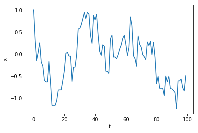
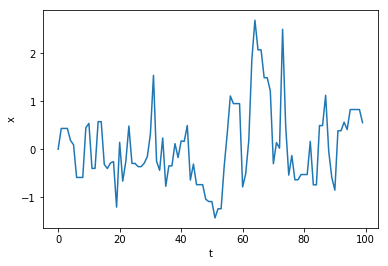
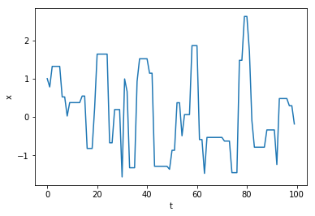
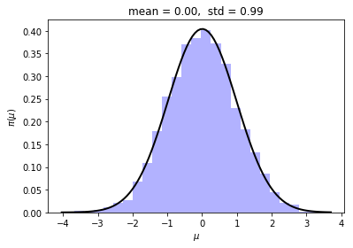
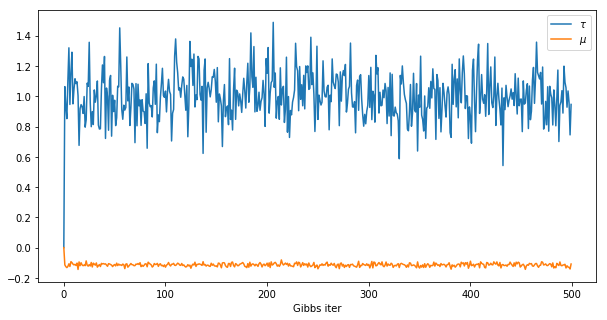
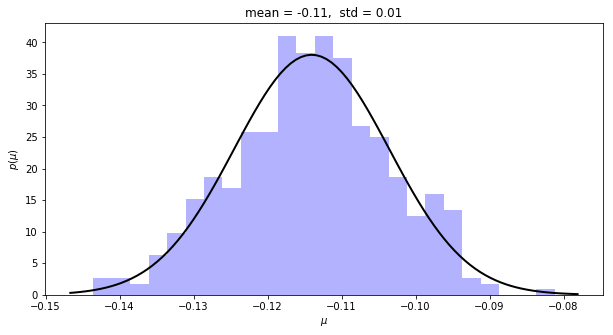
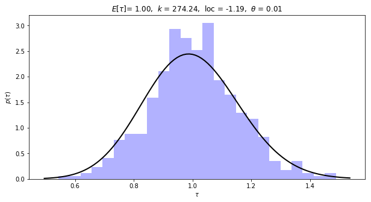

# STAT 6841 - Assignment 4

*Michal Lisicki*


## (1.)

Suppose that we wish to calculate $P(X<1, Y<1)​$, where $(X,Y)​$ are bivariate normally distributed with $corr(X,Y)=0.25​$. Use Monte Carlo integration to approximate this probability.

**Solution**

$(X,Y)\sim \text{BVN}(\mathbf{0}, \boldsymbol\Sigma)$

$\mu_X = 0$

$\mu_Y = 0$$

$\sigma_X^2 = 1$

$\sigma_Y^2 = 1​$

$\sigma_{XY} = \rho\sigma_X \sigma_Y =0.25​$

$$
\boldsymbol\Sigma = 
\begin{vmatrix}
\sigma_X^2 & \rho \sigma_X \sigma_Y \\
\rho \sigma_X \sigma_Y & \sigma_Y^2 \\
\end{vmatrix}
=
\begin{vmatrix}
1 & 0.5 \\
0.5 & 1 
\end{vmatrix}
= Cov(X,Y)
$$


$$
corr(X,Y) = \rho = \frac{Cov(X,Y)}{\sigma_X \ \sigma_Y} = 0.25
$$

$$
\begin{align}
f_\text{MVN}(\mathbf{z};\boldsymbol\mu,\boldsymbol\Sigma) &=(2\pi)^{-\frac{k}{2}} \det (\boldsymbol\Sigma)^{-\frac{1}{2}} e^{-\frac{1}{2}(\mathbf{z}-\boldsymbol\mu)^T\boldsymbol\Sigma(\mathbf{z}-\boldsymbol\mu)} \\
f_\text{BVN}(x,y;\boldsymbol\mu,\boldsymbol\Sigma) &= \frac{1}{2\pi \sigma_X \sigma_Y \sqrt{1-\rho^2}} \exp\bigg\{-\frac{1}{2(1-\rho^2)}\bigg[\frac{(x-\mu_X)^2}{\sigma_X^2} + \frac{(y-\mu_Y)^2}{\sigma_Y^2} - \frac{2\rho(x-\mu_X)(y-\mu_Y)}{\sigma_X\sigma_Y} \bigg]\bigg\} \\
&= \frac{1}{2\pi \sqrt{1-0.0625}} \exp\bigg\{-\frac{1}{2(1-0.0625)} \bigg[x^2 + y^2 - 2*0.25xy \bigg] \bigg\} \\
&= \frac{1}{2\pi\sqrt{0.9375}} \exp\bigg\{-\frac{1}{2(0.9375)} \bigg[x^2+y^2-0.5xy\bigg] \bigg\}
\end{align}
$$


$$
\begin{align}
P(X<1,Y<1) &= \int_{-\infty}^1 \int_{-\infty}^1 f(x,y;\boldsymbol\Sigma) dx dy \\
&= \int\int_A f(x,y;\boldsymbol\Sigma) dx dy \\
&= \int\int I_A f(x,y;\boldsymbol\Sigma) dx dy \\
&= E[I_A(x,y)]
\end{align}
$$

where

$$
I_A(x,y) =
\begin{cases}
1 & \text{if } (x,y) \in A \\
0 & \text{o.w.}
\end{cases}.
$$

Then

$$
P(X<1,Y<1) = \frac{1}{n} \sum_{i=1}^n I_A (x_i,y_i)
$$

where $X_i,Y_i \sim \text{BVN}(\boldsymbol0,\boldsymbol\Sigma)$.

To sample from BVN we need to iterate over two steps:

```python
def bvn(mu_x = 0, sigma_x = 1, mu_y = 0, sigma_y =1, rho = 0.25, n=100):
    samples = []
    for _ in range(n):
        # Step 1: generate x
        _x = random.normalvariate(mu_x,sigma_x)
        
        # Step 2: generate y
        _mu_y = mu_y + rho*(sigma_y/sigma_x)*(_x-mu_x)
        _sigma_y = sigma_y**2 * (1-rho**2)
        _y = random.normalvariate(_mu_y,_sigma_y)
        
        samples += [(_x,_y)]
    return samples
```

```python
z = bvn(n=1000)
x,y = zip(*z)
```

```python
import matplotlib.pyplot as plt
%matplotlib inline

plt.scatter(x,y)
```


To make the code more efficient we could also pre-calculate $\mu_Y^* = 0.25 x​$ and $\sigma_Y^{*2} = 0.9375​$.


## (2.)

Suppose $X \sim\text{Cauchy}(2,1)​$, with density:

$$
f(x) = \frac{1}{\pi (1+(x-2)^2)},\quad -\infty < x < \infty
$$

Use importance sampling method to estimate $P(X>3)​$.

**Definitions**

Suppose we are interested in obtaining an estimate of the parameters of some function of $\phi$ a distribution $f(x)$. Assuming $f(x)$, which in Bayesian statistics can be thought of as a product of a likelihood $L(\theta)$ and a prior $\pi(\theta)$, is hard to sample from, we can use importance sampling to obtain an estimate by sampling from an easier distribution. The following notation applies:

$\theta = E_f[\phi(X)] = E_g[\chi(X)]​$

$w(x) = \frac{f(x)}{g(x)}$

$\chi(x) = \phi(x) w(x)$

The variance of the estimate is minimized when

$$
g\equiv g_0 = \frac{|\phi f|}{\int |\phi f| dx}
$$

We should choose $g(x)$ to be similar in shape to $f(x)$ but more heavy tailed.

**Solution**

In our case the function $\phi$ we want to calculate our estimate over is implicit in the constraint $P(X>3)$.

$\theta = P(X>3) = \int_3^\infty f(x) dx = \int_{-\infty}^\infty I_A(x) f(x) dx = E_f[I_{(x>3)}]$

where we set $\phi(x) = I_A(x)$ and $A = \{x: x>3\}$.

We need a function $g(x)​$ that is easier to sample from and similar in behavior to $f(x)​$. To keep things simple, we can try $g(x) = \frac{c}{(x-2)^2}​$. The constant $c​$ is a scalar, which ensures that $g(x)​$ represents a proper density, i.e. $\int_{-\infty}^\infty g(x) dx =1​$. In our case as $\int_3^\infty \frac{1}{(x-2)^2} dx = -\frac{1}{x-2} \bigg\|_3^\infty​$ already equals 1 we can set $c=1​$.

Now, instead of using Monte Carlo integration to approximate $\theta$ as

$$
\hat{\theta}_f = E_f[\phi(x)] = \frac{1}{n} \sum_{i=1}^n \phi(x_i),\ x_i\sim f(x)
$$

we can use the importance sampling estimate

$$
\begin{align}
\hat{\theta}_g = E_g[\chi(x)] &= \frac{1}{n} \sum_{i=1}^n \chi (x_i) \\
&= \frac{1}{n} \sum_{i=1}^n \phi(x_i) w(x_i) \\
&= \frac{1}{n} \sum_{i=1}^n I_A(x_i) w(x_i) \\
&= \frac{1}{n} \sum_{i=1}^n  w(x_i),\ x_i\sim g(x),\ x>3
\end{align}
$$

In order to sample from any distribution numerically we can sample uniformly from the output domain of its cdf: $u_i\sim \text{Unif}(0,1)​$, and then calculate its inverse $G^{-1}(u)​$ to obtain $x_i​$.

$G(x) =P_g(X<x) = \int_3^x g(t)dt = \int_3^x \frac{1}{(t-2)^2} dt = -\frac{1}{x-2}+1 = 1-\frac{1}{x-2},\ x>3​$

To make the calculation simpler we can also sample from the inverse of the complementary cdf $\overline{G}^{-1}(u)​$ as $U_i​$ is uniformly distributed, so it doesn't if we flip the domain. The resulting distribution of $X​$ will be still the same. Therefore we have:

$\overline{G}(x) = 1-G(x) = 1- (1-\frac{1}{x-2}) = \frac{1}{x-2}​$

and the inverse can be calculated as:

$u_i = \frac{1}{x_i-2}$

$x_i=\frac{1}{u_i}+2 = \overline{G}^{-1}(u) ​$

This allows us to generate samples from $g(x)$ computationally

```python
import numpy as np
x = 1/np.random.uniform(0,1,1000)+2
```

```python
import seaborn as sns
ax = sns.distplot(x[x<10])
ax.set_xlabel('$x$')
ax.set_ylabel('$g(x)$')
```


 and estimate the parameters by plugging them into:

$$
\begin{align}
\hat{\theta}_g &= \frac{1}{n} \sum_{i=1}^n  w(x_i) \\
&= \frac{1}{n} \sum_{i=1}^n \frac{f(x_i)}{g(x_i)} \\
&= \frac{1}{n} \sum_{i=1}^n \frac{(x_i-2)^2}{\pi (1+(x_i-2)^2)} \\
\end{align}
$$

```python
w = (x-2)**2/(np.pi+1+(x-2)**2)
```

```python
plt.hist(theta_star,50)
plt.xlabel('weight')
plt.ylabel('count')
```


```python
theta = np.mean(w)
print("Theta = {}.".format(theta))
```

​    Theta = 0.5434807864325402.

which is the estimator of the expected value of $P(X>3)$.


**Additional notes**

$$
\begin{align}
\theta_f = E_f[\phi(x)] &= \int_{-\infty}^\infty \phi(x) f(x) dx \\
&= \int_{-\infty}^\infty \phi(x) \frac{f(x)}{g(x)} g(x) dx \\
&= \int_{-\infty}^\infty \phi(x) w(x) g(x) dx \\
&= \int_{-\infty}^\infty I_A(x) w(x) g(x) dx \\
&= \int_{3}^\infty w(x) g(x) dx \\
\end{align}
$$


## (3.) 

Suppose we are interested in sampling from a normal distribution $N(\mu,1)$ where $\mu$ is generated from $N(0,1)$. We consider the following proposal distribution

$$
q(x'|x)\sim N(x,\tau^2)
$$

to generate a Metropolis-Hastings MCMC to estimate $\mu​$. Try different values of the proposal variance $\tau^2​$, e.g. $\tau^2=0.1,1,10​$. From MCMC chains, report the acceptance probability, the estimate of $\mu​$ and plot the trace plot for each choice of $\tau^2​$. 

**Solution**

Proposal distribution:

$q(\mu^t\|\mu^{t-1}) = \frac{1}{\sqrt{2\pi}\tau} \exp\{-\frac{(\mu^t-\mu^{t-1})^2}{2\tau^2}\}​$ 

$q(\mu^{t-1}\|\mu^t) = \frac{1}{\sqrt{2\pi}\tau} \exp\{-\frac{(\mu^t-\mu^{t-1})^2}{2\tau^2}\}​$

Target distribution:

$\pi(\mu)=\frac{1}{\sqrt{2\pi}} \exp\{-\frac{\mu^2}{2}\}$ 

We will show that $\mu\sim N(0,1)$.


The acceptance probability for the standard MH algorithm is:
$$
\begin{align}
\alpha(\mu|\mu^t) &= \min\bigg(1, \frac{\pi(\mu^t) q(\mu^t|\mu^{t-1})}{\pi(\mu^{t-1})q(\mu^t|\mu^{t-1})}\bigg) \\
\end{align}
$$

Because the proposal distribution is symmetric the densities $q(.)$ will cancel each other. Therefore we have:

$$
\begin{align}
\alpha(\mu^t|\mu^{t-1}) &= \min\bigg(1, \frac{\pi(\mu^t)}{\pi(\mu^{t-1})}\bigg) \\
&= \min\bigg(1, \exp\bigg\{-\frac{(\mu^t)^2-(\mu^{t-1})^2}{2}\bigg\}\bigg) \\
\end{align}
$$

MCMC can be implemented in Python as follows:

```python
def metropolis_hastings(n,x0,tau):
    x=[x0]
    for t in range(1,n):
        y = np.random.normal(x[t-1],tau)
        alpha = np.exp(-(y**2-x[t-1]**2)/2)
        accept = np.minimum(1,alpha)
        u = np.random.uniform()
        if u <= accept: x.append(y)
        else: x.append(x[t-1])
    return x
```


Now let's try different $\tau$'s and see for which ones we get a good mixing.

```python
plt.plot(metropolis_hastings(n=100,x0=1, tau=np.sqrt(0.1)))
plt.xlabel('t')
plt.ylabel('x')
```



For $\tau^2=0.1$ the step is too small and it's hard to be conclusive about the target distribution.

```python
plt.plot(metropolis_hastings(n=100,x0=0, tau=1))
plt.xlabel('t')
plt.ylabel('x')
```



$\tau^2=1$ seems to work pretty well. 

```python
plt.plot(metropolis_hastings(n=100,x0=1, tau=np.sqrt(10)))
plt.xlabel('t')
plt.ylabel('x')
```



$\tau^2=10$ leads to a low acceptance rate.

Let's use $\tau^2=1$ then and use MLE to check if $\mu$ is indeed sampled from $N(0,1)$:

```python
from scipy.stats import norm

mu = metropolis_hastings(n=10000, x0=0, tau=1)

mean, std = norm.fit(mu)
plt.hist(mu, bins=25, density=True, alpha=0.3, color='b')

xmin, xmax = plt.xlim()
x = np.linspace(xmin, xmax, 100)
p = norm.pdf(x, mean, std)
plt.plot(x, p, 'k', linewidth=2)
title = "mean = %.2f,  std = %.2f" % (mean, std)
plt.title(title)
plt.xlabel("$\mu$")
plt.ylabel("$\pi(\mu)$")
```



The found parameters agree with our hypothesis.


## (4.)

Suppose that $\mathbf{y} = (y_1,...,y_{100})$ are iid observations from a $N(\mu,\tau^{-1})$ distribution. Then the likelihood is given by

$$
L(\mu,\tau;\mathbf{y})=\frac{\tau^{n/2}}{(2\pi)^{n/2}}\exp\bigg[-\frac{\tau}{2} \sum_{i=1}^n (y_i-\mu)^2 \bigg].
$$

A $N(\mu_0,\sigma_0^2)$ prior is considered for $\mu$ and a Gamma($\alpha,\beta$) prior is considered for $\tau$ . Use Gibbs Sampler to find an estimate of $\mu$ and $\tau$ suppose you generate the data $\mathbf{y}$ from $N(0, 1)$, and let $\mu_0=0$, $\sigma_0^2=1$, $\alpha=0.1$, and $\beta=0.01$.

**Solution**

*Priors*
$$
p_\mu(\mu;\mu_0,\sigma_0^2) = \frac{e^{-(\mu-\mu_0)^2/2\sigma_0^2}}{\sqrt{2\pi\sigma_0^2}},\quad \mu\in\mathbb{R}
$$

$$
p_\tau(\tau;\alpha,\beta) = \frac{e^{-\beta\tau}\beta^{\alpha}\tau^{\alpha-1}}{\Gamma(\alpha)},\quad \tau>0
$$

*Joint prior*

$$
p(\mu,\tau) = p_\mu(\mu) p_\tau(\tau)
$$

We're going to use Gibbs sampling to estimate the posterior:

$$
\pi(\mu,\tau|\mathbf{y}) \propto L(\mu,\tau;\mathbf{y}) p(\mu,\tau)
$$

We can re-write the likelihood as:

$$
\begin{align}
L(\mu,\tau;\mathbf{y}) &= \frac{\tau^{n/2}}{(2\pi)^{n/2}}\exp\bigg[-\frac{\tau}{2} \sum_{i=1}^n (y_i-\mu)^2 \bigg] \\
&= \frac{\tau^{n/2}}{(2\pi)^{n/2}}\exp\bigg[-\frac{\tau}{2} ((n-1)S^2+n(\overline{y}-\mu)^2) \bigg] \\
\end{align}
$$

where $S^2 = \frac{1}{n-1}\sum_{i=1}^n (y_i-\overline{y})​$ is a sample variance.

*Conditional posterior of $\tau$*

$$
\begin{align}
\pi(\tau|\mu,\mathbf{y}) \propto p(\mathbf{y}|\tau,\mu) p_{\tau}(\tau) &= L(\mu,\tau;\mathbf{y}) p_\tau(\tau;\alpha,\beta) \\
&= \frac{\tau^{n/2}}{(2\pi)^{n/2}}
\exp\bigg[-\frac{\tau}{2} ((n-1)S^2+n(\overline{y}-\mu)^2) \bigg] \frac{e^{-\beta\tau}\beta^{\alpha}\tau^{\alpha-1}}{\Gamma(\alpha)}\\
&= \frac{\tau^{n/2+\alpha-1}\beta^\alpha}{(2\pi)^{n/2} \Gamma(\alpha)}
\exp\bigg[-\tau \bigg(\frac{1}{2} ((n-1)S^2+n(\overline{y}-\mu)^2)+\beta \bigg) \bigg]\\
&\propto \tau^{n/2+\alpha-1}
\exp\bigg[-\tau \bigg(\frac{1}{2} ((n-1)S^2+n(\overline{y}-\mu)^2)+\beta \bigg) \bigg],\\
\end{align}
$$

which is a Gamma distribution, so:

$$
\tau|\mathbf{y} \sim \text{Gamma}\bigg(\frac{n}{2}+\alpha, \frac{1}{2} ((n-1)S^2+n(\overline{y}-\mu)^2)+\beta \bigg) \\
$$

*Conditional posterior of $\mu$*

$$
\begin{align}
\pi(\mu|\tau,\mathbf{y}) \propto p(\mathbf{y}|\tau,\mu) p_{\mu}(\mu) &= L(\mu,\tau;\mathbf{y}) p_\mu(\mu;\mu_0,\sigma_0^2) \\
&= \frac{\tau^{n/2}}{(2\pi)^{n/2}}
\exp\bigg[-\frac{\tau}{2} ((n-1)S^2+n(\overline{y}-\mu)^2) \bigg] 
\frac{e^{-(\mu-\mu_0)^2/2\sigma_0^2}}{\sqrt{2\pi\sigma_0^2}}\\
&= \frac{\tau^{n/2}}{(2\pi)^{n/2}}
\exp\bigg[-\frac{\tau}{2} (n-1)S^2 \bigg] 
\frac{1}{\sqrt{2\pi\sigma_0^2}}
\exp\bigg[-\frac{n\tau}{2} (\overline{y}-\mu)^2 - \frac{(\mu-\mu_0)^2}{2\sigma_0^2} \bigg]\\
&\propto
\exp\bigg[-\frac{n\tau(\overline{y}-\mu)^2+(\mu-\mu_0)^2\sigma_0^{-2}}{2} \bigg]\\
&=\exp\bigg[-\frac{n\tau(\overline{y}^2-2\overline{y}\mu+\mu^2)+(\mu^2-2\mu\mu_0+\mu_0^2)\sigma_0^{-2}}{2}\bigg]\\
&=\exp\bigg[-\frac{n\tau\overline{y}^2-2n\tau\overline{y}\mu+n\tau\mu^2+\sigma_0^{-2}\mu^2-2\sigma_0^{-2}\mu\mu_0+\sigma_0^{-2}\mu_0^2}{2} \bigg] \\
&=\exp\bigg[-\frac{(n\tau\overline{y}^2+\sigma_0^{-2}\mu_0^2) -2 (\sigma_0^{-2}\mu_0 + n\tau\overline{y})\mu+(n\tau+\sigma_0^{-2})\mu^2}{2} \bigg] \\
&=\exp\bigg[-\frac{\mu^2 -2 \frac{n\tau\overline{y}+\sigma_0^{-2}\mu_0}{n\tau+\sigma_0^{-2}}\mu+\frac{n\tau\overline{y}^2+\sigma_0^{-2}\mu_0^2}{n\tau+\sigma_0^{-2}}}{2(n\tau+\sigma_0^{-2})^{-1}} \bigg]
\end{align}
$$

Now in order to simplify this equation we're going to complete the square as follows:

$$
\begin{align}
\bigg(\frac{n\tau\overline{y}+\sigma_0^{-2}\mu_0}{n\tau+\sigma_0^{-2}}\bigg)^2 
&= \frac{n\tau\overline{y}^2+\sigma_0^{-2}\mu_0^2}{n\tau+\sigma_0^{-2}} + r \\
\frac{(n\tau\overline{y})^2+2n\tau\overline{y}\sigma_0^{-2}\mu_0 +(\sigma_0^{-2}\mu_0)^2}{(n\tau+\sigma_0^{-2})^2}
&= \frac{n\tau\overline{y}^2(n\tau+\sigma_0^{-2})+\sigma_0^{-2}\mu_0^2(n\tau+\sigma_0^{-2})}{(n\tau+\sigma_0^{-2})^2} + r \\
r
&= \frac{(n\tau\overline{y})^2 -n\tau\overline{y}^2(n\tau+\sigma_0^{-2}) + 2n\tau\overline{y}\sigma_0^{-2}\mu_0 + (\sigma_0^{-2}\mu_0)^2 -\sigma_0^{-2}\mu_0^2(n\tau+\sigma_0^{-2})}{(n\tau+\sigma_0^{-2})^2} \\
r
&= \frac{-n\tau\sigma_0^{-2}\overline{y}^2 + 2n\tau\sigma_0^{-2}\overline{y}\mu_0  -n\tau\sigma_0^{-2}\mu_0^2}{(n\tau+\sigma_0^{-2})^2} \\
r
&= \frac{-n\tau\sigma_0^{-2}(\overline{y}^2 - 2\overline{y}\mu_0 + \mu_0^2)}{(n\tau+\sigma_0^{-2})^2} \\
r
&= -\frac{n\tau\sigma_0^{-2}(\overline{y} - \mu_0)^2}{(n\tau+\sigma_0^{-2})^2} \\
\end{align}
$$

Then we can substitute it back:

$$
\begin{align}
\pi(\mu|\tau,\mathbf{y}) &\propto
\exp\bigg[-\frac{\mu^2 -2 \frac{n\tau\overline{y}+\sigma_0^{-2}\mu_0}{n\tau+\sigma_0^{-2}}\mu+(\frac{n\tau\overline{y}+\sigma_0^{-2}\mu_0}{n\tau+\sigma_0^{-2}})^2 -\frac{n\tau\sigma_0^{-2}(\overline{y} - \mu_0)^2}{(n\tau+\sigma_0^{-2})^2} }{2(n\tau+\sigma_0^{-2})^{-1}}  \bigg] \\
&=
\exp\bigg[-\frac{(\mu - \frac{n\tau\overline{y}+\sigma_0^{-2}\mu_0}{n\tau+\sigma_0^{-2}})^2 -\frac{n\tau\sigma_0^{-2}(\overline{y} - \mu_0)^2}{(n\tau+\sigma_0^{-2})^2} }{2(n\tau+\sigma_0^{-2})^{-1}}  \bigg] \\
&\propto
\exp\bigg[-\frac{(\mu - \frac{n\tau\overline{y}+\sigma_0^{-2}\mu_0}{n\tau+\sigma_0^{-2}})^2  }{2(n\tau+\sigma_0^{-2})^{-1}}  \bigg],
\end{align}
$$

in which case we can say that $\mu$ can be sampled from a normal distribution:

$$
\mu|\mathbf{y} \sim N\bigg(\frac{n\tau\overline{y}+\sigma_0^{-2}\mu_0}{n\tau+\sigma_0^{-2}}, \frac{1}{n\tau+\sigma_0^{-2}}\bigg)
$$

and we can use those two conditional distributions to perform Gibbs sampling.

```python
def gibbs(iter_n, n=100, mu_init=0, tau_init=0, mu_0=0, sigma_0=1, alpha=0.1, beta=0.01):
    y = np.random.normal(0,1,n)
    tau=[tau_init]
    mu=[mu_init]
    print("Sample mean %.2f" % y.mean())
    for t in range(1,iter_n):
        # In Python std gives a bias estimator, therefore we need to change (n-1)*S^2 to n*\sigma^2.
        # Also Gamma sampling function expects parameter the second parameter \theta to be 1/\beta
        tau.append(np.random.gamma(n/2+alpha, 1.0 / (0.5*(n*y.std()**2+n*(y.mean()-mu[-1])**2)+beta)))
        mu.append(np.random.normal((n*tau[-1]*y.mean()+sigma_0**(-2)*mu_0)/(n*tau[-1]+sigma_0**(-2)), \
                                   1.0 / (n*tau[-1]+sigma_0**(-2))))
    return tau,mu
```

```python
tau,mu = gibbs(iter_n=500,n=100)
```

```
Sample mean -0.11
```


```python
plt.rcParams['figure.figsize'] = (10, 5)
plt.plot(tau,label='$\\tau$')
plt.plot(mu,label='$\mu$')
plt.xlabel('Gibbs iter')
plt.legend()
```



```python
mean, std = norm.fit(mu[50:])
plt.hist(mu[50:], bins=25, density=True, alpha=0.3, color='b')

xmin, xmax = plt.xlim()
x = np.linspace(xmin, xmax, 100)
p = norm.pdf(x, mean, std)
plt.plot(x, p, 'k', linewidth=2)
title = "mean = %.2f,  std = %.2f" % (mean, std)
plt.title(title)
plt.xlabel("$\mu$")
plt.ylabel("$p(\mu)$")
```



For a sufficiently large sample $\mu$ seems to be converging to the sample mean $\overline{y}$.

```python
from scipy.stats import gamma
k, loc, theta=gamma.fit(tau)

plt.hist(tau[50:], bins=25, density=True, alpha=0.3, color='b')

xmin, xmax = plt.xlim()
x = np.linspace(xmin, xmax, 100)
p = gamma.pdf(x, k, loc, theta)
plt.plot(x, p, 'k', linewidth=2)
e_tau = k*theta+loc
title = "$E[\\tau]$= %.2f,  $k$ = %.2f,  loc = %.2f,  $\\theta$ = %.2f" % (e_tau, alpha, loc, theta)
plt.title(title)
plt.xlabel("$\\tau$")
plt.ylabel("$p(\\tau)$")
```


